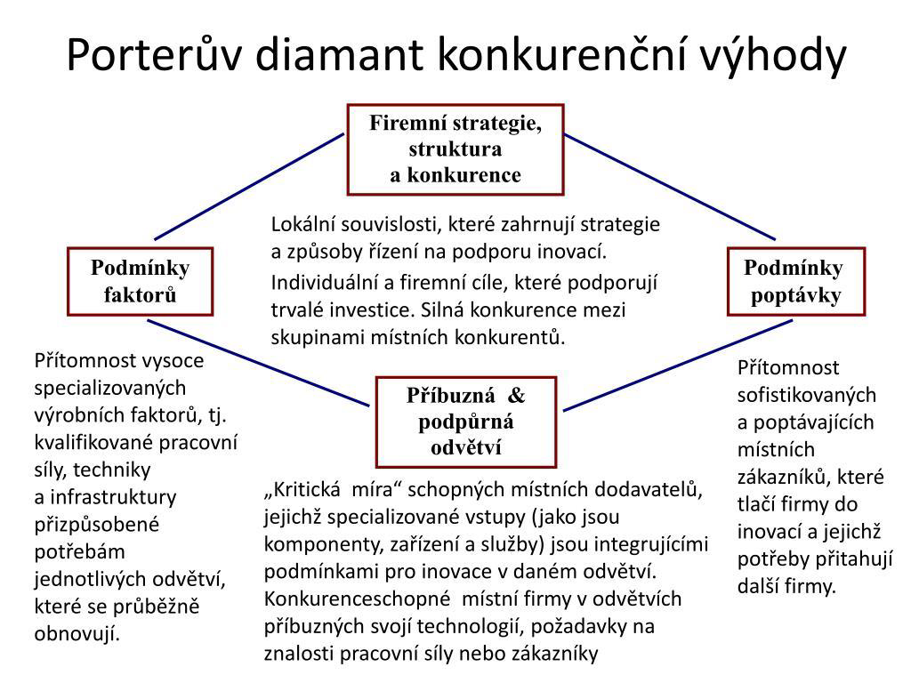

| [⬅️ Předchozí](otazka_10.md) | [🏠 Domů](../../README.md) | [Následující ➡️](otazka_12.md) |
|:-------------------------:|:---------------------------:|:-----------------------------:|

# Nakreslete a vysvětlete Porterův diamant a uveďte, k čemu slouží.

## Porterův diamant

**Porterův diamant** je model, který analyzuje faktory ovlivňující úroveň daného odvětví. Model identifikuje čtyři klíčové determinanty, které společně vytvářejí konkurenční výhodu země nebo regionu v konkrétním průmyslovém odvětví.

## Schéma Porterova diamantu

## Vysvětlení jednotlivých prvků Porterova diamantu

Rád vysvětlím jednotlivé body jednodušeji:

1. **Podmínky faktorů**  
   Jde o to, jaké zdroje má země nebo oblast k dispozici – například kvalifikovaní lidé, moderní technologie nebo dobrá infrastruktura (silnice, internet). Pokud jsou tyto zdroje kvalitní a stále se zlepšují, firmy mohou lépe vyrábět a inovovat.

2. **Podmínky poptávky**  
   Pokud jsou zákazníci v dané zemi nároční a chtějí kvalitní a nové výrobky, firmy se musí snažit a inovovat, aby jim vyhověly. To je tlačí k lepším výkonům.

3. **Příbuzná & podpůrná odvětví**  
   Pokud v okolí existují další firmy, které dodávají potřebné součástky nebo služby, je to pro hlavní firmy výhodné. Mohou spolupracovat, sdílet znalosti a rychleji inovovat.

4. **Firemní strategie, struktura a konkurence**  
   Záleží na tom, jak firmy fungují, jak jsou řízené a jaká je mezi nimi konkurence. Silná domácí konkurence a dobré vedení firmy nutí podniky být lepší a více investovat do rozvoje.

## K čemu slouží Porterův diamant

- **Faktory ovlivňující úroveň daného odvětví** - Model pomáhá analyzovat a pochopit, které faktory determinují konkurenceschopnost konkrétního odvětví.

- **Pomáhá firmám identifikovat klíčové faktory, které mohou využít k dosažení konkurenční výhody na globálních trzích** - Firmy mohou využít model k identifikaci svých silných stránek a příležitostí pro expanzi.

- **Slouží k pochopení toho, proč určité národy nebo regiony vynikají v konkrétních průmyslových odvětvích** - Model vysvětluje, proč například Švýcarsko vyniká v hodinářství nebo Itálie v módním průmyslu.

---

| [⬅️ Předchozí](otazka_10.md) | [🏠 Domů](../../README.md) | [Následující ➡️](otazka_12.md) |
|:-------------------------:|:---------------------------:|:-----------------------------:|

