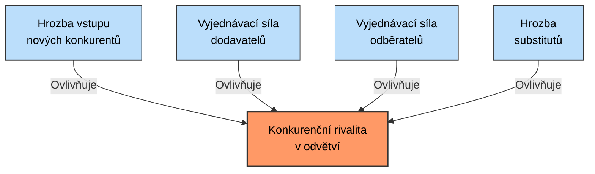
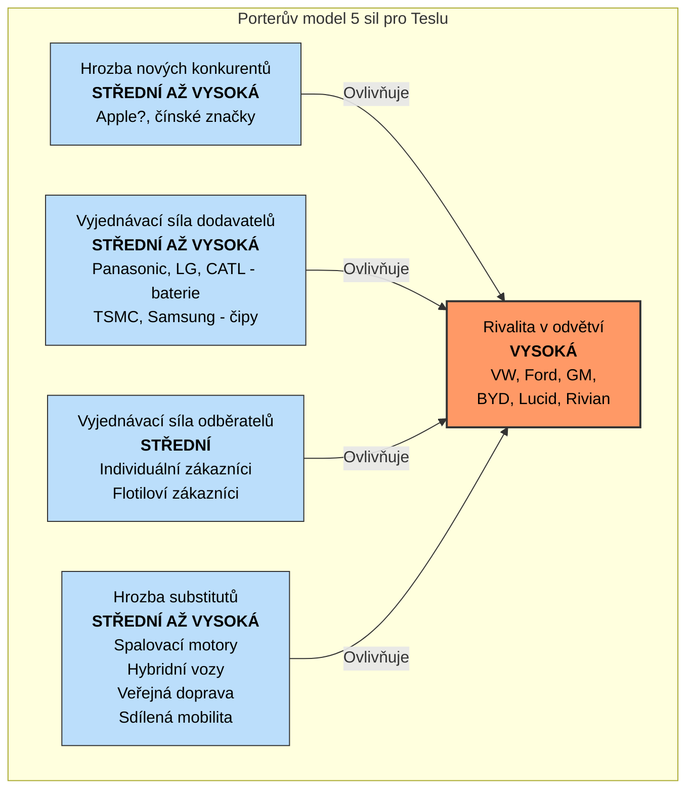

# Porterův model 5 konkurenčních sil

## Základní charakteristika modelu

Porterův model pěti konkurenčních sil je analytický nástroj vyvinutý ekonomem Michaelem E. Porterem, který slouží k:
- Posouzení atraktivity odvětví
- Identifikaci klíčových konkurenčních sil
- Porozumění dynamice odvětví
- Formulování podnikové strategie

## Vysvětlení jednotlivých sil

| Síla | Popis | Faktory, které ji posilují |
|------|-------|---------------------------|
| **1. Hrozba vstupu nových konkurentů** | Jak snadné nebo obtížné je pro nové společnosti vstoupit na trh | • Nízké kapitálové požadavky • Slabá loajalita ke značkám • Snadný přístup k distribučním kanálům • Nedostatek patentů a know-how • Nízké úspory z rozsahu |
| **2. Vyjednávací síla dodavatelů** | Schopnost dodavatelů diktovat podmínky firmám v odvětví | • Malý počet dodavatelů • Unikátní produkty či služby • Vysoké náklady na změnu dodavatele • Absence substitutů • Možnost dopředné integrace |
| **3. Vyjednávací síla odběratelů** | Schopnost zákazníků ovlivňovat ceny a podmínky | • Vysoká koncentrace zákazníků • Standardizovaný produkt • Nízké náklady na změnu dodavatele • Cenová citlivost • Možnost zpětné integrace |
| **4. Hrozba substitutů** | Existence alternativních produktů či služeb | • Nízké náklady na přechod k substitutu • Dobrý poměr cena/výkon substitutů • Změna preferencí zákazníků • Inovace v substitučních odvětvích |
| **5. Rivalita mezi stávajícími konkurenty** | Intenzita soupeření mezi firmami v odvětví | • Vysoký počet konkurentů • Pomalý růst odvětví • Vysoké fixní náklady • Nízká diferenciace produktů • Vysoké bariéry výstupu z odvětví |

## Příklad: Tesla, Inc. (odvětví elektromobilů)

### 1. Hrozba vstupu nových konkurentů: STŘEDNÍ AŽ VYSOKÁ

**Bariéry vstupu:**
- ✅ Vysoké kapitálové náklady (výroba, R&D)
- ✅ Silná značka Tesla a loajalita zákazníků
- ✅ Technologické know-how a patenty
- ✅ Úspory z rozsahu

**Faktory zvyšující hrozbu:**
- ❗ Rostoucí atraktivita trhu s elektromobily
- ❗ Technologický pokrok (sdílené platformy)
- ❗ Vládní podpora elektromobility
- ❗ Vstup technologických firem s kapitálem

### 2. Vyjednávací síla dodavatelů: STŘEDNÍ AŽ VYSOKÁ

**Klíčové faktory:**
- ❗ Koncentrace dodavatelů kritických komponentů
- ❗ Klíčový význam baterií a čipů
- ❗ Vysoké náklady na změnu dodavatelů
- ✅ Snaha Tesly o vertikální integraci (vlastní baterie)
- ✅ Dlouhodobé strategické partnerství s dodavateli

### 3. Vyjednávací síla odběratelů: STŘEDNÍ

**Klíčové faktory:**
- ✅ Nízká koncentrace individuálních zákazníků
- ✅ Diferenciovaný produkt (značka, software, ekosystém)
- ❗ Rostoucí dostupnost informací pro zákazníky
- ❗ Vysoká cenová citlivost (prémiový segment)
- ❗ Větší síla flotilových zákazníků

### 4. Hrozba substitutů: STŘEDNÍ AŽ VYSOKÁ

**Hlavní substituty:**
- ❗ Automobily se spalovacími motory (nižší cena)
- ❗ Hybridní automobily (přechodné řešení)
- ❗ Veřejná doprava
- ❗ Sdílená mobilita (Uber, carsharing)
- ❗ Mikromobilita (elektrokola, koloběžky)

**Faktory snižující hrozbu:**
- ✅ Rostoucí ekologické povědomí
- ✅ Klesající ceny elektromobilů
- ✅ Rozšiřování nabíjecí infrastruktury

### 5. Rivalita mezi stávajícími konkurenty: VYSOKÁ A ROSTOUCÍ

**Faktory zvyšující rivalitu:**
- ❗ Rostoucí počet konkurentů (tradiční i noví výrobci)
- ❗ Vysoké fixní náklady výroby
- ❗ Boj o tržní podíl na rostoucím trhu
- ❗ Zvyšující se cenový tlak (zejména z Číny)

**Konkurenční výhody Tesly:**
- ✅ Silná značka a loajalita zákazníků
- ✅ Technologický náskok (software, baterie)
- ✅ Vlastní síť Superchargerů
- ✅ Vertikální integrace

## Strategické implikace pro Teslu

1. **Snížení závislosti na dodavatelích** - Pokračovat ve vertikální integraci (baterie, čipy)
2. **Posílení diferenciace** - Inovace v softwaru, autonomním řízení, ekosystému
3. **Budování bariér vstupu** - Rozšiřování sítě Superchargerů a servisních center
4. **Cenová strategie** - Postupné snižování cen díky úsporám z rozsahu
5. **Expanze na nové trhy** - Geografická expanze a vstup do nových segmentů

## Závěr

Porterův model pěti sil poskytuje Tesle (i jakémukoliv jinému podniku) strukturovaný rámec pro analýzu konkurenčního prostředí a formulaci strategie. V případě Tesly ukazuje na vysoce konkurenční prostředí, kde klíčem k úspěchu je kontinuální inovace, vertikální integrace a budování silného ekosystému.

