| [⬅️ Předchozí](otazka_15.md) | [🏠 Domů](../../README.md) | [Následující ➡️](otazka_17.md) |
|:-------------------------:|:---------------------------:|:-----------------------------:|

# Navrhněte, nakreslete a vysvětlete organizační strukturu univerzity.

**Odpověď:**

Organizační struktura univerzity je kl칤캜ovým prvkem pro její efektivní fungování a dosahování cílů v oblasti vzdělávání, výzkumu a společenského přínosu. Definuje hierarchii, rozdělení pravomocí, odpovědností a komunikační toky v rámci instituce. N칤쬰 je navr쬰n a vysvětlen typický model organizační struktury univerzity.

**Návrh organizační struktury univerzity:**

Univerzity jsou komplexní organizace a jejich struktura se m콢쬰 lišit v závislosti na velikosti, zaměření a tradici. B캩쬹캩 se však setkáváme s kombinací funkcionální a divizionální struktury.

*   **Vrcholové vedení:**
    *   **Rektor:** Nejvyšší představitel univerzity, zodpovědný za celkové řízení a strategické směřování.
    *   **Prorektoři:** Zástupci rektora pro specifické oblasti, např. pro studium a pedagogickou činnost, pro vědu a výzkum, pro zahraniční vztahy, pro rozvoj, pro vnitřní zále쬴tosti/finance.
*   **Akademické jednotky (Divize):**
    *   **Fakulty:** Základní vzdělávací a vědecko-výzkumné jednotky, obvykle zaměřené na určitý obor nebo skupinu oborů (např. Filozofická fakulta, Přírodovědecká fakulta, Ekonomická fakulta). Ka쬯치 fakulta má v čele **děkana**.
    *   **Katedry/Ústavy:** Menší specializované jednotky v rámci fakult, vedené **vedoucím katedry/ústavu**. Zajišťují výuku konkrétních předmětů a realizují výzkumné projekty.
    *   **Vysokoškolské ústavy/Výzkumná centra:** Mohou existovat i samostatné ústavy nebo centra s celouniverzitní působností, zaměřené na specifický výzkum nebo specializované slu쬭y.
*   **Akademická samospráva:**
    *   **Akademický senát univerzity:** Zastupitelský orgán slo쬰ný ze zástupců akademických pracovníků a studentů. Schvaluje vnitřní předpisy, rozpočet, volí rektora atd.
    *   **Akademické senáty fakult:** Obdobné orgány na úrovni fakult.
*   **Administrativní a podpůrné útvary (Funkcionální jednotky):**
    *   **Kancelář rektora/Kvestorát:** Zajišťuje administrativní podporu vedení univerzity a řízení hospodářských a správních činností (kvestor).
    *   **Studijní oddělení:** Administrativa spojená se studiem.
    *   **Oddělení vědy a výzkumu:** Podpora výzkumných projektů, grantů.
    *   **Oddělení zahraničních vztahů:** Mezinárodní spolupráce, mobility studentů a zaměstnanců.
    *   **Ekonomické oddělení:** Účetnictví, finance, rozpočet.
    *   **Personální oddělení:** Lidské zdroje.
    *   **Informační technologie (IT oddělení/Centrum informačních technologií):** Správa IT infrastruktury.
    *   **Knihovna/Informační centrum:** Knihovnické a informační slu쬭y.
    *   **Správa majetku a slu쬰b:** Údr쬭a budov, ubytování, stravování.

**Schéma organizační struktury univerzity (Popis pro nákres):**

Schéma by mělo být hierarchické:

1.  Na vrcholu je **Rektor**.
2.  Pod ním jsou **Prorektoři** (např. pro studium, pro vědu, pro zahraničí).
3.  Na stejné úrovni jako prorektoři, nebo mírně pod nimi, je **Kvestor** (řídící hospodářsko-správní úsek).
4.  Paralelně s výkonným vedením (rektor, prorektoři, kvestor) stojí **Akademický senát univerzity** jako samosprávný orgán.
5.  Pod prorektory (nebo přímo pod rektorem, v závislosti na konkrétním uspo콏치dání) jsou jednotlivé **Fakulty**, ka쬯치 vedená **Děkanem**.
6.  Ka쬯치 fakulta má svůj **Akademický senát fakulty**.
7.  V rámci fakult jsou **Katedry/Ústavy**, vedené vedoucími.
8.  Centrální administrativní a podpůrné útvary (knihovna, IT, ekonomické odd., personální odd. atd.) mohou být znázorněny bu캞 pod kvestorem, nebo jako útvary přímo podřízené rektorovi či příslušným prorektorům, poskytující slu쬭y nap콏칤캜 univerzitou.

**Vysvětlení principů fungování:**

Tato struktura kombinuje principy:

*   **Liniového řízení:** Jasná hierarchie od rektora přes děkany až po vedoucí kateder.
*   **Funkcionální specializace:** Prorektoři a centrální administrativní útvary se specializují na konkrétní funkce (studium, věda, finance).
*   **Divizionální struktury:** Fakulty fungují jako relativně autonomní divize zaměřené na specifické obory.
*   **Samosprávy:** Akademické senáty zajišťují participaci akademické obce na řízení.

Koordinace mezi jednotlivými částmi je zajištěna prostřednictvím porad vedení, komisí, projektových týmů a formálních i neformálních komunikačních kanálů. Cílem je efektivní alokace zdrojů, podpora excelence ve vzdělávání a výzkumu a flexibilní reakce na potřeby studentů a společnosti.

**Příklad z praxe:**

Představme si fiktivní Univerzitu Jana Amose Komenského. Tato univerzita má rektora a tři prorektory (pro studium, pro vědu a výzkum, pro zahraniční vztahy). Má čtyři fakulty: Filozofickou, Přírodovědeckou, Pedagogickou a Ekonomickou. Ka쬯치 fakulta má svého děkana a několik kateder (např. na Filozofické fakultě je Katedra historie, Katedra jazyků, Katedra filozofie). Univerzita má také centrální knihovnu, IT centrum a studijní oddělení, které slou쮂 všem fakultám. Akademický senát univerzity se skládá ze zástupců všech fakult a studentů a schvaluje kl칤캜ové dokumenty. Tato struktura umo쮄갓je specializaci fakult na jejich obory, zatímco centrální orgány zajišťují koordinaci a podporu. Například, pokud chce Katedra historie na Filozofické fakultě zahájit nový mezinárodní výzkumný projekt, bude spolupracovat s prorektorem pro vědu a výzkum (pro získání podpory a financování) a s prorektorem pro zahraniční vztahy (pro navázání kontaktů s partnerskými univerzitami v zahraničí).

**Zdroje:**

*   CHLÁDKOVÁ, Helena. *Organizovani-zaklad.pptx*. Interní materiály předmětu.
*   BLAŽEK, Ladislav. *Management: organizování, rozhodování, ovlivňování*. 2., rozš. vyd. Praha: Grada, 2014. Expert (Grada). ISBN 978-80-247-4429-2. (Poznámka: Tento zdroj byl uveden v prezentaci, pro obecné principy organizačních struktur.)

**Vizualizace organizační struktury:**

```mermaid
graph TB
    R[Rektor] --> P1[Prorektor pro studium]
    R --> P2[Prorektor pro vědu a výzkum]
    R --> P3[Prorektor pro zahraniční vztahy]
    R --> K[Kvestor]
    
    subgraph Akademická samospráva
    AS[Akademický senát univerzity]
    end
    
    R -.-> AS
    
    subgraph Podpůrné útvary
    K --> EO[Ekonomické oddělení]
    K --> PO[Personální oddělení]
    K --> SO[Správa majetku]
    end
    
    P1 --> F1[Filozofická fakulta]
    P1 --> F2[Přírodovědecká fakulta]
    P1 --> F3[Pedagogická fakulta]
    P1 --> F4[Ekonomická fakulta]
    
    subgraph Filozofická fakulta
    F1 --> KH[Katedra historie]
    F1 --> KJ[Katedra jazyků]
    F1 --> KF[Katedra filozofie]
    ASF1[Akademický senát FF]
    F1 -.-> ASF1
    end
    
    subgraph Centrální jednotky
    CJ1[Knihovna]
    CJ2[IT centrum]
    CJ3[Studijní oddělení]
    end
```

---

| [⬅️ Předchozí](otazka_15.md) | [🏠 Domů](../../README.md) | [Následující ➡️](otazka_17.md) |
|:-------------------------:|:---------------------------:|:-----------------------------:|

