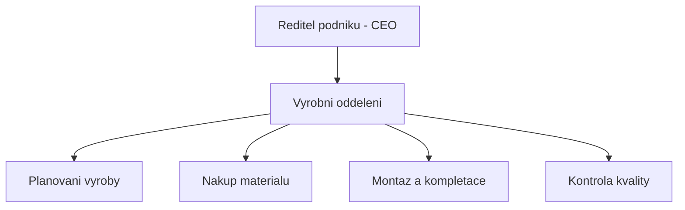
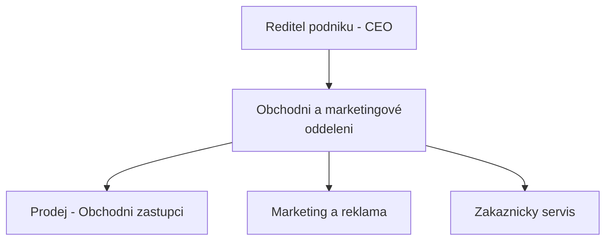
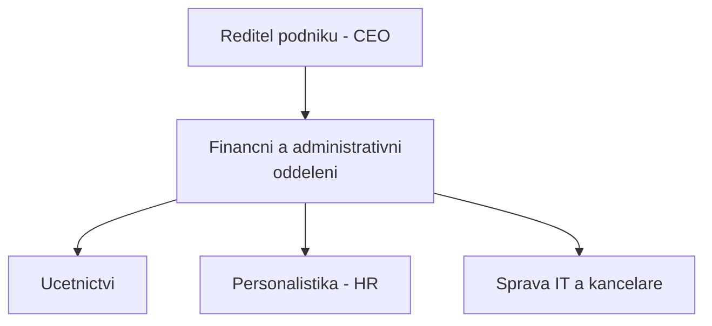
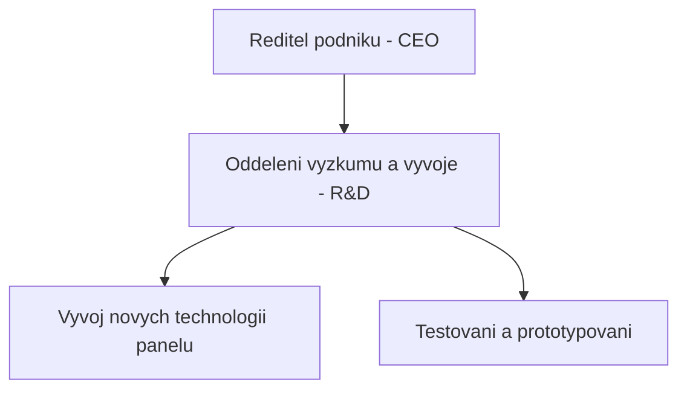

| [⬅️ Předchozí](otazka_6.md) | [🏠 Domů](../../README.md) | [Následující ➡️](otazka_8.md) |
|:-------------------------:|:---------------------------:|:-----------------------------:|

# Navrhněte, nakreslete a vysvětlete organizační strukturu pro podnik vyrábějící jeden typ výrobku.

Pro podnik, který vyrábí pouze jeden typ výrobku, je často nejvhodnější a nejefektivnější **funkcionální (funkční) organizační struktura**. Tento typ struktury seskupuje zaměstnance a činnosti podle podobných funkcí nebo specializací. Je charakteristická jasnou hierarchií a centralizovaným rozhodováním, což může být výhodné pro menší až středně velké podniky s úzkým produktovým portfoliem.

## Návrh funkcionální organizační struktury

Předpokládejme podnik **Solární Panel Profi s.r.o.**, který se specializuje výhradně na výrobu a prodej jednoho typu fotovoltaických panelů.

### Grafické znázornění (Popis)

Na vrcholu organizační struktury by byl **Ředitel podniku (CEO)**. Přímo pod ním by byly jednotlivé funkční útvary (oddělení), každý vedený svým manažerem (vedoucím oddělení). Tyto útvary by byly:

1.  **Výrobní oddělení**
2.  **Obchodní a marketingové oddělení**
3.  **Finanční a administrativní oddělení**
4.  **(Volitelně, dle velikosti a zaměření) Oddělení výzkumu a vývoje (R&D)**

Každé z těchto oddělení by mělo své interní členění podle specifických činností.

#### Vrcholová úroveň

#### Výrobní oddělení

#### Obchodní a marketingové oddělení

#### Finanční a administrativní oddělení

#### Oddělení výzkumu a vývoje (R&D) – volitelné

### Stručný popis jednotlivých oddělení

- **Ředitel podniku (CEO):** Zodpovídá za celkové vedení firmy, stanovuje strategii, rozhoduje o klíčových otázkách a reprezentuje podnik navenek. Koordinuje práci všech oddělení a dohlíží na plnění cílů společnosti.

- **Výrobní oddělení:** Zajišťuje kompletní proces výroby fotovoltaických panelů – od plánování výroby, přes nákup materiálu, samotnou montáž až po kontrolu kvality hotových výrobků. Dbá na efektivitu výroby a dodržování technologických postupů.

- **Obchodní a marketingové oddělení:** Odpovídá za prodej výrobků, komunikaci se zákazníky a vyhledávání nových obchodních příležitostí. Zajišťuje marketingové kampaně, propagaci firmy a péči o zákazníky včetně řešení jejich požadavků a reklamací.

- **Finanční a administrativní oddělení:** Spravuje finanční toky podniku, vede účetnictví, zajišťuje mzdy a personální agendu (HR). Dále se stará o administrativní podporu, správu kanceláře a IT infrastruktury.

- **Oddělení výzkumu a vývoje (R&D) (volitelné):** Zaměřuje se na inovace, vývoj nových technologií a zlepšování stávajících produktů. Provádí testování, prototypování a sleduje trendy v oboru, aby firma zůstala konkurenceschopná.

---
**Použité zdroje:**

*   *Organizovani-zaklad.pptx* [PowerPointová prezentace]. Poskytnuto jako studijní materiál. (Informace o typech organizačních struktur, zejména funkcionální struktuře.)
*   Obecné znalosti z oblasti organizačních struktur a managementu.

---

| [⬅️ Předchozí](otazka_6.md) | [🏠 Domů](../../README.md) | [Následující ➡️](otazka_8.md) |
|:-------------------------:|:---------------------------:|:-----------------------------:|

