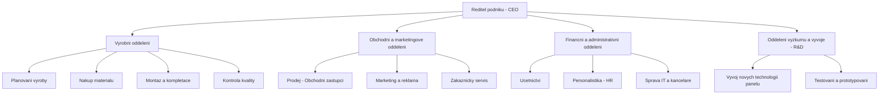

# Otázka 7: Navrhněte, nakreslete a vysvětlete organizační strukturu pro podnik vyrábějící jeden typ výrobku.

Pro podnik, který vyrábí pouze jeden typ výrobku, je často nejvhodnější a nejefektivnější **funkcionální (funkční) organizační struktura**. Tento typ struktury seskupuje zaměstnance a činnosti podle podobných funkcí nebo specializací. Je charakteristická jasnou hierarchií a centralizovaným rozhodováním, což může být výhodné pro menší až středně velké podniky s úzkým produktovým portfoliem.

Jelikož přímé kreslení diagramů v Markdownu není plně podporováno, organizační struktura bude popsána a její typické grafické znázornění vysvětleno slovně.

## Návrh funkcionální organizační struktury

**Předpokládejme podnik "Solární Panel Profi s.r.o.", který se specializuje výhradně na výrobu a prodej jednoho typu fotovoltaických panelů.**

### Grafické znázornění (Popis)

Na vrcholu organizační struktury by byl **Ředitel podniku (CEO)**. Přímo pod ním by byly jednotlivé funkční útvary (oddělení), každý vedený svým manažerem (vedoucím oddělení). Tyto útvary by byly:

1.  **Výrobní oddělení**
2.  **Obchodní a marketingové oddělení**
3.  **Finanční a administrativní oddělení**
4.  **(Volitelně, dle velikosti a zaměření) Oddělení výzkumu a vývoje (R&D)**

Každé z těchto oddělení by mělo své interní členění podle specifických činností.

*(Poznámka: Výše uvedený kód je pro Mermaid.js, který dokáže generovat diagramy z textu. V čistém Markdownu by se jednalo o slovní popis hierarchie.)*

### Vysvětlení jednotlivých útvarů a jejich funkcí pro "Solární Panel Profi s.r.o.":

1.  **Ředitel podniku (CEO):**
    *   **Odpovědnost:** Celkové strategické řízení podniku, stanovování cílů, reprezentace podniku navenek, klíčová rozhodnutí.
    *   **Vysvětlení:** V podniku vyrábějícím jeden typ výrobku má ředitel přímý dohled nad všemi klíčovými funkcemi a zajišťuje jejich koordinaci a soulad se strategií.

2.  **Výrobní oddělení (Vedoucí výroby):**
    *   **Odpovědnost:** Zajištění plynulé a efektivní výroby solárních panelů v požadované kvalitě a množství.
    *   **Podřízené jednotky/činnosti:**
        *   **Plánování výroby:** Sestavování výrobních plánů na základě objednávek a prognóz prodeje.
        *   **Nákup materiálu:** Zajišťování včasného nákupu všech potřebných komponent a surovin pro výrobu panelů (křemíkové články, sklo, rámy atd.).
        *   **Montáž a kompletace:** Samotný proces sestavování panelů, obsluha výrobních linek.
        *   **Kontrola kvality:** Průběžná a výstupní kontrola kvality výrobků, dodržování standardů.
    *   **Vysvětlení:** Pro podnik zaměřený na jeden produkt je efektivní a kvalitní výroba klíčová. Centralizace těchto činností pod jednoho vedoucího umožňuje dobrou koordinaci a optimalizaci výrobních procesů.

3.  **Obchodní a marketingové oddělení (Obchodní/Marketingový ředitel):**
    *   **Odpovědnost:** Prodej vyrobených solárních panelů, budování značky, získávání nových zákazníků a péče o stávající.
    *   **Podřízené jednotky/činnosti:**
        *   **Prodej:** Aktivní vyhledávání a oslovování potenciálních zákazníků (instalační firmy, developeři, koncoví uživatelé), tvorba cenových nabídek, uzavírání smluv.
        *   **Marketing a reklama:** Tvorba marketingových strategií, propagačních materiálů, správa webových stránek a sociálních médií, účast na veletrzích.
        *   **Zákaznický servis:** Poskytování informací o produktu, řešení dotazů a reklamací zákazníků.
    *   **Vysvětlení:** I s jedním produktem je nutné aktivně oslovovat trh a budovat povědomí. Spojení obchodu a marketingu do jednoho útvaru zajišťuje konzistentní komunikaci a strategii prodeje.

4.  **Finanční a administrativní oddělení (Finanční/Administrativní ředitel nebo Hlavní účetní):**
    *   **Odpovědnost:** Správa financí podniku, účetnictví, personalistika a celková administrativní podpora.
    *   **Podřízené jednotky/činnosti:**
        *   **Účetnictví a controlling:** Vedení účetnictví, fakturace, správa pohledávek a závazků, finanční plánování a reporting.
        *   **Personalistika (HR):** Nábor a výběr zaměstnanců, mzdová agenda, školení a rozvoj, pracovněprávní záležitosti.
        *   **Správa IT a kanceláře:** Zajištění fungování informačních technologií, správa kancelářských prostor a vybavení.
    *   **Vysvětlení:** Tyto podpůrné funkce jsou nezbytné pro chod každého podniku. Jejich centralizace je efektivní z hlediska nákladů a sdílení zdrojů.

5.  **Oddělení výzkumu a vývoje (R&D) (Vedoucí R&D) - volitelné:**
    *   **Odpovědnost:** Inovace produktu, sledování nových technologií v oblasti fotovoltaiky, zlepšování vlastností a efektivity stávajícího panelu.
    *   **Podřízené jednotky/činnosti:**
        *   **Vývoj nových technologií panelů:** Výzkum nových materiálů, konstrukčních řešení.
        *   **Testování a prototypování:** Ověřování funkčnosti a spolehlivosti inovovaných prvků.
    *   **Vysvětlení:** I když podnik vyrábí jen jeden typ výrobku, pro dlouhodobou konkurenceschopnost je důležité produkt inovovat. Existence samostatného R&D oddělení závisí na strategii podniku a velikosti investic do inovací. U menších podniků může být tato funkce integrována do výrobního oddělení nebo zajišťována externě.

### Výhody navržené funkcionální struktury pro podnik s jedním typem výrobku:

*   **Specializace:** Umožňuje vysokou míru specializace v rámci jednotlivých funkcí, což vede k efektivitě a rozvoji odborných znalostí.
*   **Jasná odpovědnost a hierarchie:** Každý zaměstnanec ví, komu je odpovědný a jaké jsou jeho úkoly.
*   **Efektivní využití zdrojů:** Centralizace funkcí může vést k úsporám z rozsahu a lepšímu využití zdrojů.
*   **Jednoduchost a přehlednost:** Pro podnik s jedním produktem je tato struktura relativně jednoduchá na řízení a pochopení.
*   **Snadná kontrola:** Vrcholové vedení má dobrou kontrolu nad jednotlivými funkčními oblastmi.

### Možné nevýhody:

*   **Menší flexibilita:** Může být méně pružná při reakci na rychlé změny trhu.
*   **Potenciální komunikační bariéry mezi útvary:** Může docházet k tzv. "silo efektu", kdy jednotlivá oddělení spolu nedostatečně komunikují a spolupracují.
*   **Pomalé rozhodování u komplexnějších problémů:** Rozhodnutí vyžadující spolupráci více útvarů mohou být zdlouhavá.
*   **Omezený rozvoj manažerů pro komplexnější role:** Manažeři se specializují pouze na svou funkci.

Pro podnik "Solární Panel Profi s.r.o." by však výhody funkcionální struktury, zejména v počátečních fázích a při soustředění na jeden produkt, pravděpodobně převažovaly nad nevýhodami.

---
**Použité zdroje:**

*   *Organizovani-zaklad.pptx* [PowerPointová prezentace]. Poskytnuto jako studijní materiál. (Informace o typech organizačních struktur, zejména funkcionální struktuře.)
*   Obecné znalosti z oblasti organizačních struktur a managementu.

