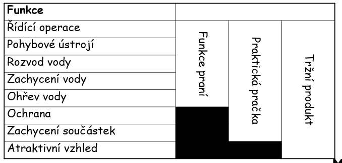
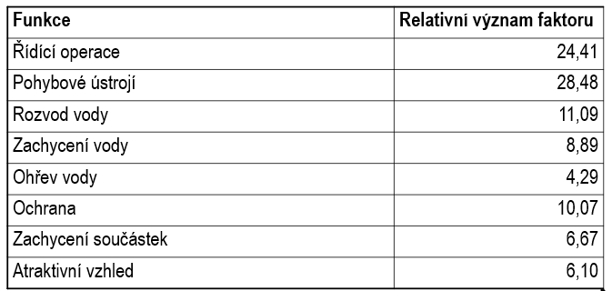

| [⬅️ Předchozí](otazka_24.md) | [🏠 Domů](../../README.md) | [Následující ➡️](otazka_26.md) |
|:-------------------------:|:---------------------------:|:-----------------------------:|

# Popište Taguchiho přístup k vývoji produktu

Taguchiho přístup k vývoji produktu je systematická metoda zaměřená na **minimalizaci variability** a **zvýšení odolnosti** výrobků a procesů vůči rušivým vlivům (tzv. šumové faktory). Hlavní cíle jsou **vysoká kvalita** a **nízké náklady**.

## Hlavní principy Taguchiho přístupu

- **Robustní design**: Navrhování produktů a procesů tak, aby byly co nejméně citlivé na změny prostředí, opotřebení nebo lidské chyby.
- **Minimalizace ztrát**: Každá odchylka od cílové hodnoty znamená ztrátu pro zákazníka i společnost. Taguchiho **ztrátová funkce** ukazuje, že ztráta roste kvadraticky s odchylkou od cíle.
- **Optimalizace parametrů**: Cílem je najít taková nastavení parametrů, která minimalizují vliv šumu a maximalizují výkon.

## Klíčové nástroje

- **Ortogonální pole**: Umožňují efektivně testovat více faktorů a jejich úrovní s minimálním počtem experimentů.
- **Poměr signálu k šumu (S/N ratio)**: Statistická míra pro hodnocení výkonu a odolnosti vůči variabilitě.

## Fáze návrhu podle Taguchiho

1. **Systémový návrh** – koncepční návrh produktu nebo procesu.
2. **Parametrický návrh** – optimalizace nastavení parametrů pro robustnost.
3. **Toleranční návrh** – stanovení vhodných tolerancí bez zbytečného zvyšování nákladů.

## Využití v praxi

- Taguchiho metody jsou doporučovány standardy jako **QS 9000** a **IATF 16949**.
- Jsou součástí metodik **Six Sigma** (DMAIC) a **APQP** při návrhu výrobků a procesů.

**Shrnutí:** Taguchiho přístup pomáhá navrhovat produkty a procesy, které jsou stabilní, kvalitní a odolné vůči vnějším vlivům, a to efektivně a s nízkými náklady.

---

| [⬅️ Předchozí](otazka_24.md) | [🏠 Domů](../../README.md) | [Následující ➡️](otazka_26.md) |
|:-------------------------:|:---------------------------:|:-----------------------------:|

